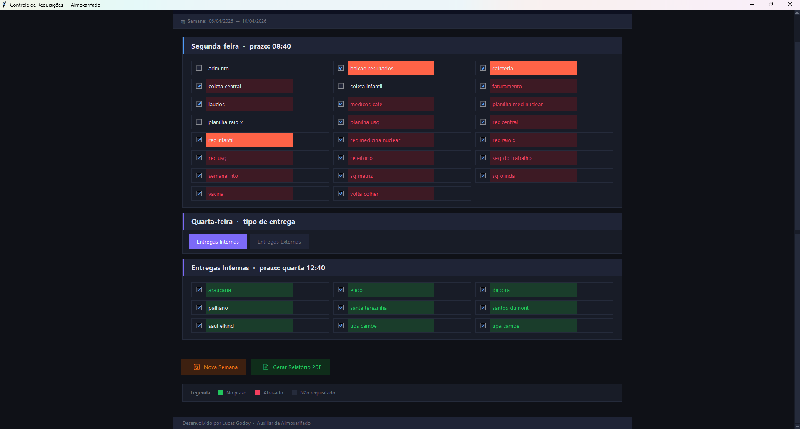
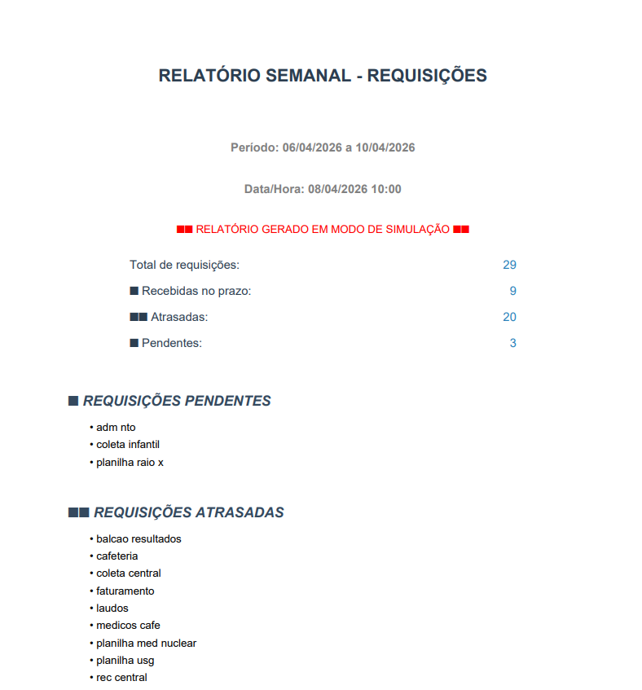

[PROJECT__URL]: https://github.com/LucasGodoyFP/relatorio-semanal
[PROJECT__BADGE]: https://img.shields.io/badge/📱Visitar_esse_projeto-000?style=for-the-badge&logo=project
[PYTHON_BADGE]: https://img.shields.io/badge/Python-3.11.9-blue?style=for-the-badge&logo=python&logoColor=lightskyblue
[TKINTER_BADGE]: https://img.shields.io/badge/Tkinter-GUI-blue?style=for-the-badge
[JSON_BADGE]: https://img.shields.io/badge/JSON-Data-black?style=for-the-badge

<h1 align="center" style="font-weight: bold;">Controle de Pedidos - Lab Imagem </h1>
<p align="center">
  Sistema para controle e monitoramento de pedidos com geração automática de relatórios semanais.
</p>

![python][PYTHON_BADGE]
![tkinter][TKINTER_BADGE]
![json][JSON_BADGE]

<details open="open">
<summary>Sumário</summary>
 
- [Sobre](#about)
- [Como rodar](#started)
  - [Pré-requisitos](#prerequisites)
  - [Clonando](#cloning)
  - [Executando](#starting)

</details>

<p align="center">
    
</p>
<p align="center">
    
</p>

<h2 id="about"> Sobre</h2>

Aplicação desenvolvida em Python com Tkinter para monitoramento de prazos de pedidos do almoxarifado da Lab Imagem.
O sistema gera relatórios semanais automatizados, classificando pedidos como atrasados ou pendentes.

[![project][PROJECT__BADGE]][PROJECT__URL]

<h2 id="started"> Como rodar</h2>

<h3 id="prerequisites">Pré-requisitos</h3>

Requisitos necessários para rodar o projeto:

- [Python 3.10+](https://www.python.org/)

<h3 id="cloning" >Clonando</h3>

Como clonar o projeto

```bash
git clone https://github.com/LucasGodoyFP/relatorio-semanal.git
```

<h3 id="starting">Executando</h3>

Como executar o projeto

```bash
cd relatorio-semanal
python main.py
```
